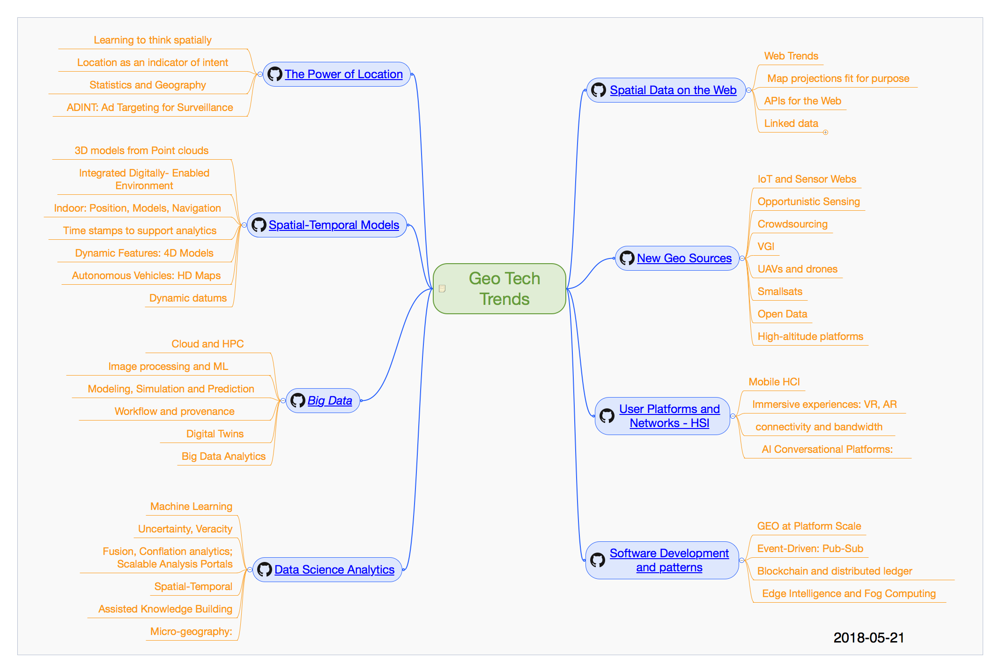

# OGC-Technology-Trends
Geospatial technology trends as tracked by the Open Geospatial Consortium (OGC) and the OGC Architecture Board (OAB).  

## Trends grouped in topic areas:

   * [The Power of Location](chapter-01.adoc)
   * [Spatial and Temporal Models](chapter-02.adoc)
   * [Data Science Analytics](chapter-04.adoc)
   * [Big Data](chapter-03.adoc)
   * [Spatial Data on the Web](chapter-05.adoc)
   * [New Geo Sources](chapter-06.adoc)
   * [Human Computer Interaction](chapter-07.adoc)
   * [Software Development and Patterns](chapter-08.adoc)

___________

## Ripe Trends

High Priority
* [Blockchain/Distributed Ledger](Trends/BlockchainAnddistributedledger.adoc)
* [GEO at Platform Scale](Trends/GEOAtPlatformScale.adoc)
* [Machine Learning/CNNs](Trends/MachineLearning.adoc)
* [Modeling, Simulation and Prediction](Trends/ModSimPredict.adoc)
* [Simultaneous Localization And Mapping/SLAM](Trends/SimultaneousLocalizationAndMappingSLAM.adoc)
* [UAVs and Drones](Trends/UXS.adoc)
* [Web of Data](Trends/WebofData.adoc)

Second Priority
* [3D model creation](Trends/3DModels.adoc)
* [Edge and Fog Computing](Trends/EdgeIntelligenceAndFogComputing.adoc)
* [Immersive Geo: AR, VR, Mixed Reality](Trends/ImmersiveGeo.adoc)
* [Indoor positioning](Trends/Indoor.adoc)
* [Quantum Computing](Trends/QuantumComputing.adoc)
* [Workflow/Provenance](Trends/WorkflowAndProvenance.adoc)

___________

## Intellectual Property Rights

The content of this document is copyrighted by the Open Geospatial Consortium (OGC) and may be [licensed](https://github.com/opengeospatial/er_template/blob/master/LICENSE) for designated purposes.

Attention is drawn to the possibility that some of the elements of this document may be the subject of patent rights. The Open Geospatial Consortium shall not be held responsible for identifying any or all such patent rights.

Recipients of this document are requested to submit, with their comments, notification of any relevant patent claims or other intellectual property rights of which they may be aware that might be infringed by any implementation of the standard set forth in this document, and to provide supporting documentation.
