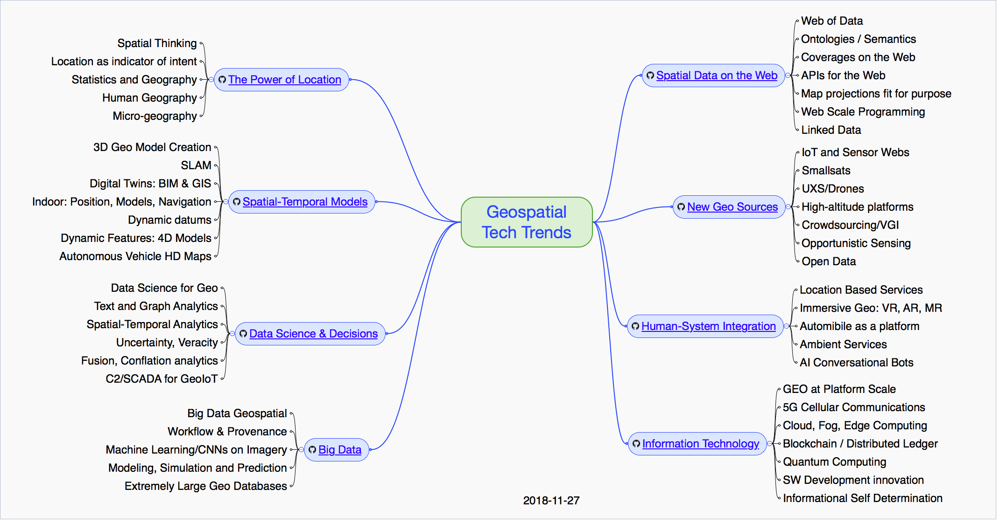

= OGC-Technology-Trends
Geospatial technology trends as tracked by the Open Geospatial Consortium (OGC) and the OGC Architecture Board (OAB) are listed on this and linked pages. A summary of all tracked Trends is provided in the mindmap.  A set of Ripe Trends have been identified as summarized in the Trend Assessment.  Also avaiable is an overview of the link:http://www.opengeospatial.org/OGCTechTrends[Technology Trends process].

Each Trend is linked to a GitHub issue - *Comments are welcome and encouraged on the issue linked to the trend*

[discrete]
== Trends grouped into meta-trends:

   * <<chapter-01,The Power of Location>>
   * <<chapter-02,Spatial and Temporal Models>>
   * <<chapter-04,Data Science and Decisions>>
   * <<chapter-03,Big Data>>
   * <<chapter-05,Spatial Data on the Web>>
   * <<chapter-06,New Geo Sources>>
   * <<chapter-07,Human-System Integration>>
   * <<chapter-08,Information Technology>>

[discrete]
== Ripe Trends

A subset of the Tech Trends identified as "Ripe Trends" are assessed as highest and second priority through an analysis summarized in the graphic below.

Highest Priority

* <<AutonomousVehiclesHDMaps,Autonomous Vehicle HD Maps>>
* <<BlockchainAnddistributedledger,Blockchain/Distributed Ledger>>
* <<GEOAtPlatformScale,GEO at Platform Scale>>
* <<MachineLearning,Machine Learning/CNNs>>
* <<ModSimPredict,Modeling, Simulation and Prediction>>
* <<UXS,UAVs and Drones>>
* <<WebofData,Web of Data>>

Second Priority

* <<3DModels,3D model creation>>
* <<5G,5G Cellular Communications>>
* <<EdgeIntelligenceAndFogComputing,Edge and Fog Computing>>
* <<ImmersiveGeo,Immersive Geo: AR, VR, Mixed Reality>>
* <<Indoor,Indoor: Position, Models and Navigation>>
* <<QuantumComputing,Quantum Computing>>
* <<WorkflowAndProvenance,Workflow/Provenance>>

Ripe Trends are identified based on characterizations of trend Impact (Disruptive or Sustaining) and Horizon (Next or After Next).  The trends for highest priority consideration are Trends assessed as Disruptive and Next.

image::images/TrendAssessment.png[Trend Assessment]

[discrete]
== Intellectual Property Rights

The content of this document is copyrighted by the Open Geospatial Consortium (OGC) and may be link:https://github.com/opengeospatial/er_template/blob/master/LICENSE[licensed] for designated purposes.

Attention is drawn to the possibility that some of the elements of this document may be the subject of patent rights. The Open Geospatial Consortium shall not be held responsible for identifying any or all such patent rights.

Recipients of this document are requested to submit, with their comments, notification of any relevant patent claims or other intellectual property rights of which they may be aware that might be infringed by any implementation of the standard set forth in this document, and to provide supporting documentation.
