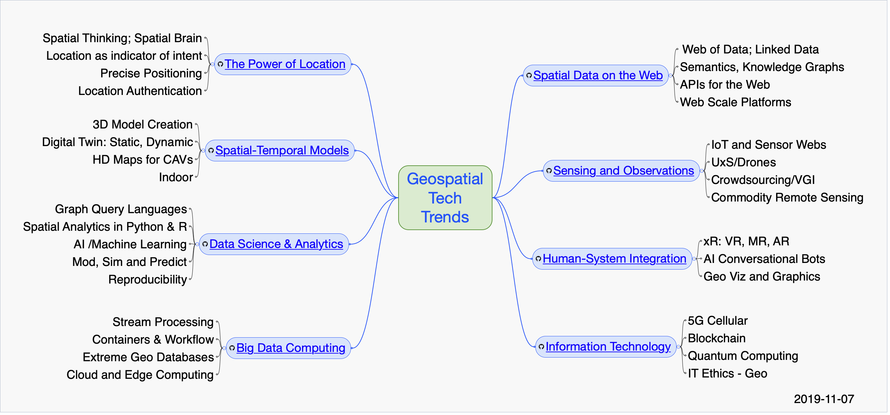
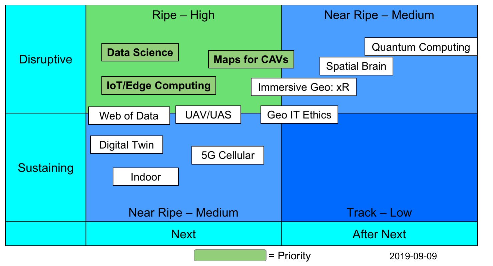

[[ogc-technology-trends]]
OGC-Technology-Trends
---------------------

Geospatial technology trends as tracked by the Open Geospatial
Consortium (OGC) and the OGC Architecture Board (OAB) are listed on this
and linked pages. A summary of all tracked Trends is provided in the
mindmap. A set of Ripe Trends have been identified as summarized in the
Trend Assessment. Also available is an overview of the
http://www.opengeospatial.org/OGCTechTrends[Technology Trends process].

Each Trend is linked to a GitHub issue - _Comments are welcome and
encouraged on the issue linked to the trend_

[[trends-grouped-into-meta-trends]]
Trends grouped into meta-trends:
~~~~~~~~~~~~~~~~~~~~~~~~~~~~~~~~

* link:chapter-01.adoc[The Power of Location]
* link:chapter-02.adoc[Spatial and Temporal Models]
* link:chapter-04.adoc[Data Science and Decisions]
* link:chapter-03.adoc[Big Data]
* link:chapter-05.adoc[Spatial Data on the Web]
* link:chapter-06.adoc[New Geo Sources]
* link:chapter-07.adoc[Human-System Integration]
* link:chapter-08.adoc[Information Technology]

'''''

[[ripe-trends]]
Ripe Trends
~~~~~~~~~~~

A subset of the Tech Trends identified as ``Ripe Trends'' are assessed
as highest and second priority through an analysis summarized in the
graphic below.

Highest Priority * link:Trends/AutonomousVehiclesHDMaps.adoc[Autonomous
Vehicle HD Maps] *
link:Trends/BlockchainAnddistributedledger.adoc[Blockchain/Distributed
Ledger] * link:Trends/GEOAtPlatformScale.adoc[GEO at Platform Scale] *
link:Trends/MachineLearning.adoc[Machine Learning/CNNs] *
link:Trends/ModSimPredict.adoc[Modeling, Simulation and Prediction] *
link:Trends/UXS.adoc[UAVs and Drones] * link:Trends/WebofData.adoc[Web
of Data]

Second Priority * link:Trends/3DModels.adoc[3D model creation] *
link:Trends/5G.adoc[5G Cellular Communications] *
link:Trends/EdgeIntelligenceAndFogComputing.adoc[Edge and Fog Computing]
* link:Trends/ImmersiveGeo.adoc[Immersive Geo: AR, VR, Mixed Reality] *
link:Trends/Indoor.adoc[Indoor: Position, Models and Navigation] *
link:Trends/QuantumComputing.adoc[Quantum Computing] *
link:Trends/WorkflowAndProvenance.adoc[Workflow/Provenance]

Ripe Trends are identified based on characterizations of trend Impact
(Disruptive or Sustaining) and Horizon (Next or After Next). The trends
for highest priority consideration are Trends assessed as Disruptive and
Next.

 ___________

[[intellectual-property-rights]]
Intellectual Property Rights
~~~~~~~~~~~~~~~~~~~~~~~~~~~~

The content of this document is copyrighted by the Open Geospatial
Consortium (OGC) and may be
https://github.com/opengeospatial/er_template/blob/master/LICENSE[licensed]
for designated purposes.

Attention is drawn to the possibility that some of the elements of this
document may be the subject of patent rights. The Open Geospatial
Consortium shall not be held responsible for identifying any or all such
patent rights.

Recipients of this document are requested to submit, with their
comments, notification of any relevant patent claims or other
intellectual property rights of which they may be aware that might be
infringed by any implementation of the standard set forth in this
document, and to provide supporting documentation.
